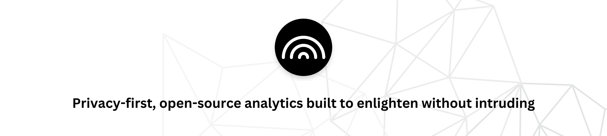

    <!-- Project Banner -->
    <picture>
        <source srcset="./.github/assets/banner-dark.png" media="(prefers-color-scheme: dark)">
        <source srcset="./banner.png" media="(prefers-color-scheme: light)">
        
    </picture>
    <!-- Project Title -->
    <h2 align="center">
        Arunya
    </h2>
    <!-- Project header -->
    

        The most comprehensive authentication library for TypeScript
         
        <a href="https://arunya.0xsarwagya.codes"><strong>Learn more »</strong></a>
         
         
        <a href="https://discord.gg/KWbhFb6Duf">Discord</a>
        ·
        <a href="https://arunya.0xsarwagya.codes">Website</a>
        ·
        <a href="https://github.com/0xsarwagya/arunya/issues">Issues</a>
    

## About the Project
Arunya was born out of a simple frustration: why should understanding your audience come at the cost of their privacy? As a cybersecurity engineer, I’ve seen how user data is often treated as an afterthought or exploited for profit. When I started building Arunya, the goal was clear—create an analytics tool I’d feel comfortable using myself. One that respects user privacy, stays transparent, and puts you in control. It’s not just about compliance; it’s about trust. Arunya is my answer to balancing insight and integrity, built for anyone who values both.

### Why Arunya
Traditional analytics tools often demand a trade-off between gaining insights and protecting user privacy. Arunya eliminates that compromise. Designed with privacy at its core, it ensures no personal data is stored or shared while providing you with powerful tools like session replays and custom event tracking.

With Arunya, you stay in control. Deploy it on your own infrastructure, maintain compliance with privacy laws like GDPR and CCPA, and gain meaningful insights without sacrificing trust. Whether you’re a developer, a business owner, or a privacy-conscious creator, Arunya offers a solution that respects your users and delivers results.

## Contribution

Arunya is free and open source project licensed under the [AGPL 3.0 License](./LICENSE). You are free to do whatever you want with it.

You could help continuing its development by:

- [Contribute to the source code](./CONTRIBUTING.md)
- [Suggest new features and report issues](https://github.com/0xsarwagya/arunya/issues)

## Security
If you discover a security vulnerability within Better Auth, please send an e-mail to **[contact@0xsarwagya.codes](mailto:contact@0xsarwagya.codes)**.

All reports will be promptly addressed, and you'll be credited accordingly.